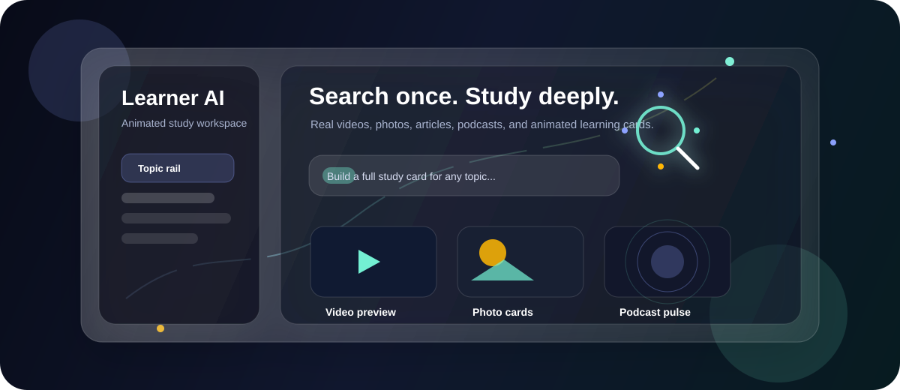

# Learner AI



Learner AI is an animated AI learning dashboard that turns a single topic search into a deep, structured study workspace. It is built for learners who want more than a short answer: readable explanations, clickable subtopics, real media previews, progress tracking, practice areas, and a calm dashboard layout that stays consistent while the content changes.

## What It Looks Like

The app uses a glass-style dashboard with a fixed topic rail on the left and a focused learning stage on the right. Generated topics become scrollable study cards with sections for explanations, subtopics, key terms, scenarios, videos, photos, articles, and podcasts.

The UI includes:

- A consistent two-column study workspace with a collapsible topic rail.
- React Three Fiber ambient background motion.
- An animated particle search icon inside the topic generator button.
- Smooth hover states, glowing learning links, animated media cards, and podcast pulse effects.
- Real media previews when topic generation returns usable public URLs.
- YouTube preview thumbnails and in-page video playback through embedded players.
- Photo cards that can render direct image URLs and open reliable source pages.
- Podcast cards that support real episode pages and direct audio files when available.

## Photos And Videos

Learner AI is designed to make generated study pages feel visual, not plain-text only. When Gemini returns real media URLs, the dashboard separates them into video, photo, article, and podcast sections so each resource gets the right preview style.

| Media Type | How It Renders |
| --- | --- |
| Videos | YouTube and Vimeo links open in an in-page player. YouTube links also show generated thumbnails. |
| Photos | Stable direct image URLs render as image cards and full preview modals. Source pages open when direct images are not available. |
| Articles | Article and guide cards open the original source. |
| Podcasts | Podcast pages open from the card; direct audio files render with an audio player. |

The README banner above is an animated GitHub-safe preview of that experience: the search particles move, the media cards float, the video tile shows a play preview, the photo tile shows an image-style card, and the podcast tile pulses like an audio surface. Inside the real app, those cards are connected to actual topic media returned by the AI route.

## Tech Stack

- **Next.js 15** with the App Router
- **React 19**
- **Firebase Auth** for user login
- **Firestore** for profiles, preferences, dashboard state, saved topics, and progress
- **Gemini GenerateContent API** for AI topic generation and optional practice review
- **React Three Fiber** and **Drei** for 3D ambient scenes and particle UI
- **Three.js** as the rendering engine behind the 3D effects
- **CSS animations** for card motion, media hover effects, loaders, and theme polish
- **Graphify** for maintaining a code knowledge graph during development

## Core Features

- Search any topic and generate a complete study path.
- Save generated topics per user and track.
- Navigate subtopics from the sidebar accordion.
- Open a reader mode for deeper long-form study.
- Mark subtopics complete and unlock progress milestones.
- Render real videos, photos, articles, and podcasts when available.
- Automatically adapt terminal practice for technical topics.
- Support LWC, Apex, JavaScript, Python, Java, C++, Go, Rust, and other programming-language study flows.
- Keep non-technical topics reading-first without forcing code practice.
- Personalize theme presets from learner interests and recent queries.

## AI Topic Generation

The topic generator asks Gemini for a structured learning object with:

- Title, level, focus, objectives, and deep explanations
- Long-read paragraphs
- Branch topics and clickable subtopic cards
- Key terms and applied scenarios
- Beginner, intermediate, and advanced assessments when useful
- Practice terminal configuration for technical topics
- Real media suggestions across video, photo, article, and podcast resources

The media prompt is intentionally strict: it asks for real public URLs and rejects placeholder, demo, fake, or invented preview links.

## Project Structure

```text
app/
  api/topic-generator/      AI topic generation route
  api/ai-feedback/          Practice review route
  dashboard/                Dashboard and reader routes
components/
  topic-dashboard.jsx       Main learning dashboard
  media-shelf.jsx           Video, photo, article, and podcast previews
  search-particle-icon.jsx  React Three Fiber search animation
  theme-ambient-scene.jsx   Animated background scene
  practice-terminal.jsx     Floating practice workspace
lib/
  dashboard-store.js        Firestore dashboard state
  profile-store.js          User profile and preferences
  personalization.js        Theme and interest matching
graphify-out/
  GRAPH_REPORT.md           Code graph summary
```

## Setup

1. Install dependencies.

```bash
npm install
```

2. Copy the example environment file.

```bash
cp .env.example .env.local
```

3. Add Firebase and Gemini values to `.env.local`.

```env
NEXT_PUBLIC_FIREBASE_API_KEY=
NEXT_PUBLIC_FIREBASE_AUTH_DOMAIN=
NEXT_PUBLIC_FIREBASE_PROJECT_ID=
NEXT_PUBLIC_FIREBASE_STORAGE_BUCKET=
NEXT_PUBLIC_FIREBASE_MESSAGING_SENDER_ID=
NEXT_PUBLIC_FIREBASE_APP_ID=
GEMINI_API_KEY=
GEMINI_MODEL=gemini-2.5-flash-lite
```

4. Start the local app.

```bash
npm run dev
```

## Useful Scripts

```bash
npm run dev
npm run build
npm run start
npm run lint
```

## Notes

The practice terminal is a learner workspace and review surface. It does not replace real Salesforce compilation for LWC or Apex. For production-grade Salesforce validation, connect a Salesforce org, Salesforce CLI flow, or server-side compiler pipeline.

The app can generate rich topic content only when `GEMINI_API_KEY` is configured. Without it, real AI topic generation is unavailable.

## Development

This repository uses Graphify for codebase navigation. After code changes, update the graph with:

```bash
python -m graphify update .
```

The dashboard code is intentionally organized around a few key surfaces:

- `TopicDashboard` owns the learning workspace state and layout.
- `MediaShelf` owns media detection, thumbnails, embeds, and preview modals.
- `ThemeAmbientScene` owns the ambient 3D background.
- `SearchParticleIcon` owns the animated search-button particle effect.

## License

Private project. Add a license before publishing as an open-source repository.
